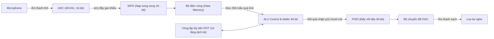

# BTL Tín hiệu và Hệ thống - HUST: Máy trợ thính số đa kênh MSDAP & Thuật toán POT

Chào mừng bạn đến với kho lưu trữ dự án Bài tập lớn môn **Tín hiệu và Hệ thống (lớp 154852)** - Đại học Bách Khoa Hà Nội.

Đề tài: **"Thiết kế và mô phỏng bộ lọc số FIR đa kênh Stereo tối ưu hóa không dùng bộ nhân ứng dụng trong thiết bị trợ thính"**

Dự án này lưu trữ toàn bộ mã nguồn mô phỏng tín hiệu, tệp slide thuyết trình học thuật, các đoạn mã tự động hóa PowerPoint và **Ứng dụng Web mô phỏng tương tác 6 bước xử lý DSP thời gian thực**.

---

## 🎮 Trải nghiệm Ứng dụng Mô phỏng trực quan (Web Simulator)

Ứng dụng web được xây dựng bằng công nghệ thuần HTML5, CSS3 và Vanilla Javascript (không cần thư viện ngoài), sử dụng **Web Audio API** để tổng hợp âm thanh thực tế và **Canvas** để vẽ sóng thời gian thực ở tốc độ 60 khung hình/giây.

### 🔗 Cách chạy chương trình:
1.  Tải tệp [index.html](index.html) về máy tính của bạn.
2.  Kích đúp chuột vào tệp `index.html` để mở nó trực tiếp trên Chrome, Edge hoặc Firefox.
3.  **Tương tác trực tiếp:**
    *   Kéo các thanh trượt điều chỉnh tần số giọng nói và nhiễu môi trường để thấy 6 biểu đồ dạng sóng biến đổi mượt mà theo thời gian thực.
    *   Nhấp vào nút **[Nghe Âm Thô]** để nghe âm thanh bị rít chói tai dải cao $12\text{ kHz}$.
    *   Nhấp vào nút **[Nghe Qua Máy Trợ Thính]** để nghe âm thanh đã lọc sạch nhiễu qua bộ xử lý MSDAP và thuật toán dịch bit POT.

---

## 📊 Quy trình 6 bước biến đổi tín hiệu trong Máy trợ thính

Hệ thống mô phỏng chính xác chuỗi khâu chuyển đổi vật lý của thiết bị đeo tai y tế di động:

1.  **Bước 1: Sóng âm vào (Analog $x(t)$)** - Sóng tương tự nguyên bản tần số hữu ích (ví dụ: $500\text{ Hz}$).
2.  **Bước 2: Sau Microphone (Lẫn nhiễu)** - Chuyển sang tín hiệu điện áp nhưng bị lẫn tạp âm cao tần của gió hoặc tiếng hú ($12\text{ kHz}$).
3.  **Bước 3: Sau bộ ADC (Số hóa $x(n)$)** - Lấy mẫu tại tần số $48\text{ kHz}$ và lượng tử hóa 16-bit thành dạng bậc thang kỹ thuật số.
4.  **Bước 4: Sau bộ xử lý MSDAP (Thuật toán POT)** - Bộ xử lý **MSDAP** dùng chung cấu trúc chia sẻ thời gian kết hợp **Thuật toán POT (Powers-of-Two)** dịch bit lũy tiến $1\text{-bit}$ lồng nhau để lọc sạch nhiễu hoàn toàn mà không cần bất kỳ bộ nhân phần cứng nào.
5.  **Bước 5: Sau bộ DAC (Khôi phục)** - Tái tạo chuỗi số sạch $y(n)$ thành tín hiệu điện tương tự mượt mà.
6.  **Bước 6: Ngõ ra Loa / Receiver (Khuếch đại)** - Loa phát âm thanh sạch đã khuếch đại vào tai người bệnh thính lực.

---

## 🛠️ Cấu trúc thư mục mã nguồn

*   `index.html`: Mã nguồn trang web mô phỏng tương tác 6 bước.
*   `slides_structure.txt`: Tệp văn bản chứa cấu trúc chi tiết của 14 slide thuyết trình chuẩn HUST.
*   `generate_and_embed_all_plots_v3.py`: Tập lệnh Python sử dụng `numpy`, `scipy` và `matplotlib` để mô phỏng thuật toán POT, vẽ các đồ thị chất lượng cao và nhúng trực tiếp chúng vào đúng vị trí các cột slide PowerPoint.
*   `generate_adc_plot.py` & `generate_dsp_plots.py`: Các tập lệnh vẽ đồ thị đơn lẻ cho khâu ADC và miền thời gian/tần số.

---

## 🎓 Về Đề tài nghiên cứu HUST

Trong các máy trợ thính thương mại, việc xử lý độc lập hai kênh (Stereo) yêu cầu hai bộ xử lý DSP song song cồng kềnh. Hệ thống **MSDAP (Mini Stereo Digital Audio Processor)** đề xuất của nhóm nghiên cứu giải quyết bằng cách:
*   **Chia sẻ thời gian (Time-sharing):** Sử dụng chung một cấu trúc ALU duy nhất để xử lý luân phiên kênh Trái và Phải.
*   **Loại bỏ bộ nhân:** Biểu diễn hệ số bộ lọc dưới dạng lũy thừa cơ số 2 (POT). Thu gọn phép chập khổng lồ của bộ lọc FIR bậc 64 thành các phép toán cộng, trừ cơ bản phối hợp luân phiên tuần tự với mạch dịch thanh ghi $1\text{-bit}$ (phép nhân với $2^{-1}$).
*   **Hiệu quả phần cứng:** Tiết kiệm hơn **65% diện tích silicon** cổng logic trên chip và giảm thiểu triệt để công suất tiêu hao tự thân, giúp pin máy trợ thính kéo dài tuổi thọ tối đa.
